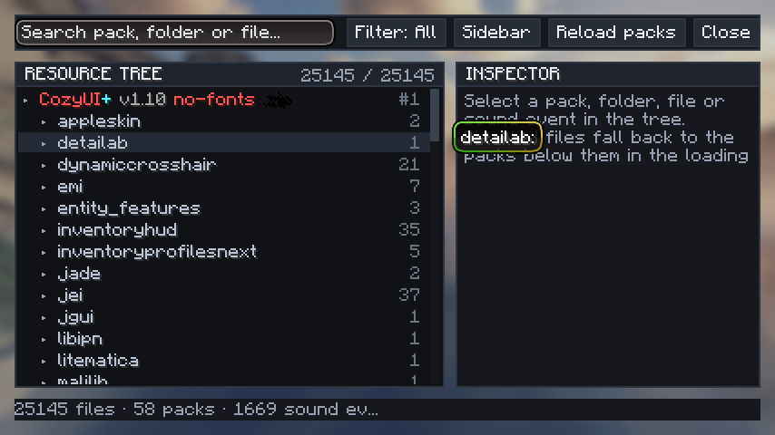
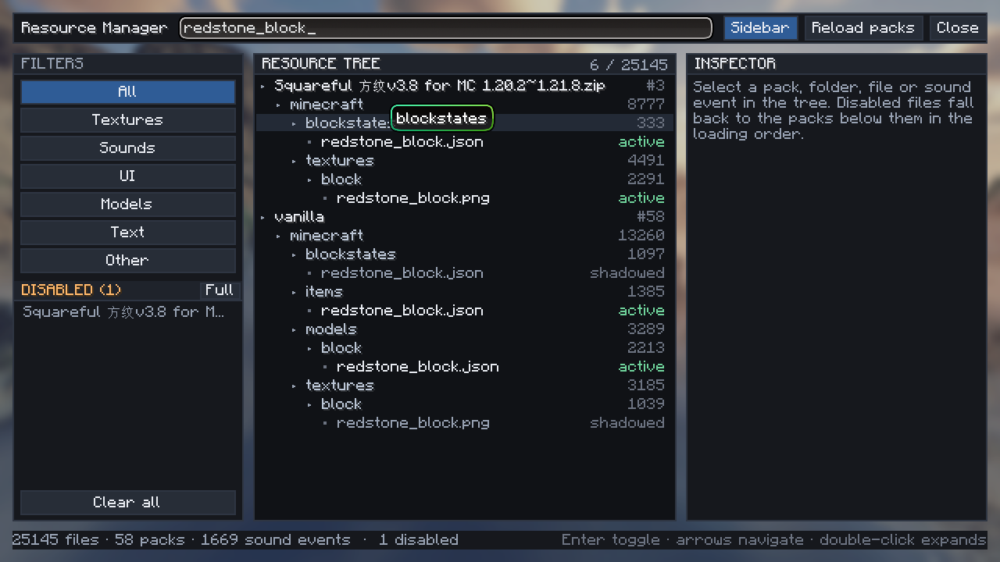
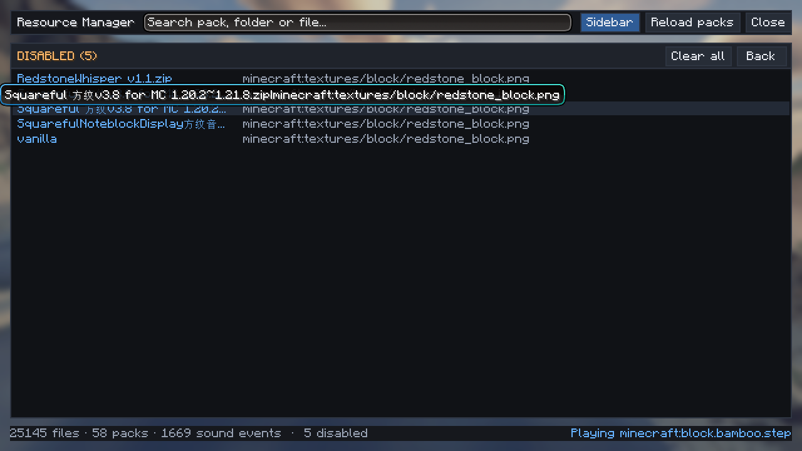
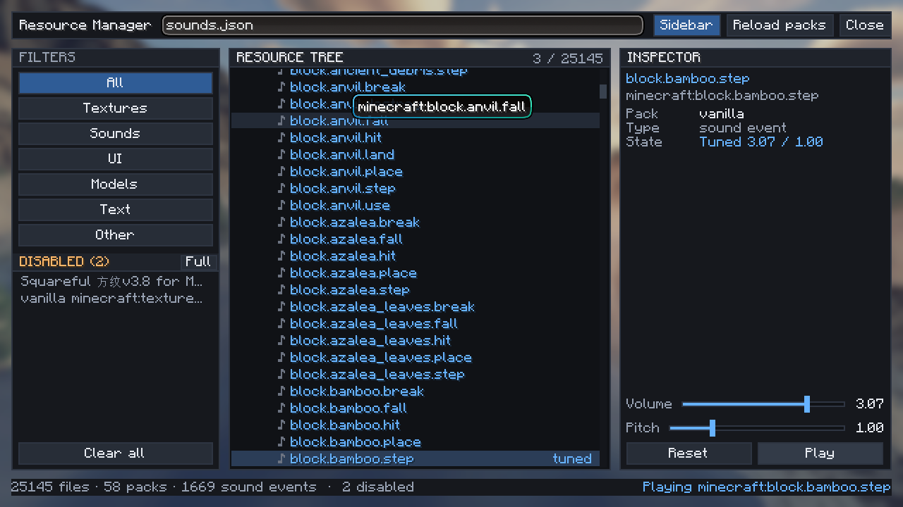
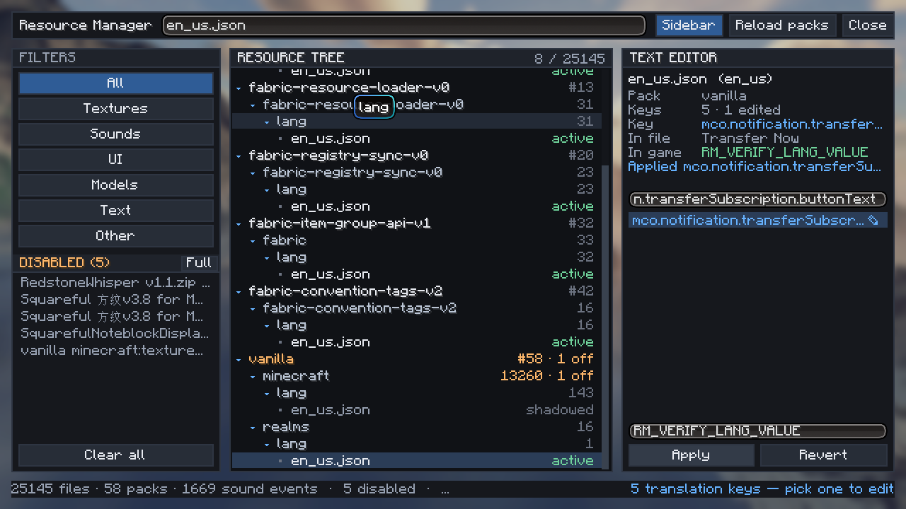
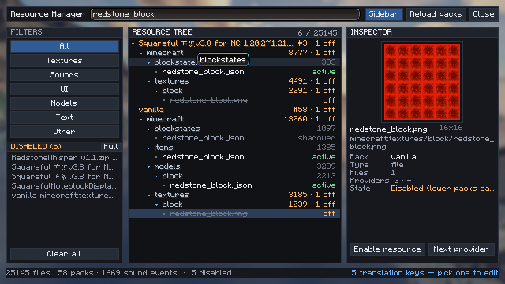

# ResourceManager

**在游戏内直接调试资源包的 Fabric 客户端模组（Minecraft 1.21.8）。**

按 **F8** 打开，用文件管理器式的树浏览所有已启用资源包，关掉某一个贴图 / 模型 / 音效 / UI 图：
这个包就不再提供该文件，交给加载顺序更靠前的包。还可以调 `sounds.json` 里任意音效事件的音量与
音高、预览即将改动的贴图、改 `lang` 键让游戏内文本立刻变化。

[English](README.md) · [反馈问题](https://github.com/abelian2E47/ResourceManager/issues)

## 特点

- **文件管理器式布局** —— 工具栏、侧栏、资源树、检查器、状态栏各自独立成块；窗口变窄时侧栏自动
  收起，不会互相压住。
- **层级树** —— 资源包 → 命名空间 → 目录 → 文件，每个节点带文件数、被禁用数（`off`）和
  `sounds.json` 事件的 `♪` 标记。
- **搜索与分类** —— 按资源包、命名空间、路径或文件名过滤，命中的分支自动展开，标题显示
  `命中 / 总数`；也可以一键切到 贴图 / 音效 / UI / 模型 / 文本 / 其他。
- **精确禁用单个资源** —— 被禁用的包不再提供该文件，由下面的包接管。检查器里能看出谁在生效、被谁
  覆盖、还有哪些包提供同一个文件；资源包、命名空间、目录可以整块禁用，再点一次确认。
- **音效调试** —— 每个事件的音量与音高可调 0–4 倍，直接作用于真实播放；**Play** 立刻试听，状态栏
  会说明是否真的响了。
- **贴图预览** —— 检查器里按整数倍画出选中的图片，旁边标注真实尺寸和此刻在提供它的资源包。
- **文本编辑** —— 任意 `lang` 键都能改，包括物品名；键列表会显示每个键对应的游戏内文本，过滤器
  也匹配这些文本，所以可以直接搜 `Diamond Sword`。
- **全屏禁用列表** —— DISABLED 面板可以铺满整个窗口，双列显示，鼠标和键盘都能操作。
- **纯客户端** —— 只改变本机客户端加载和渲染的内容，不向服务器发送任何数据；服务器下发的资源包
  同样可以在本地禁用。
- **所有改动只有一个配置文件**，重开游戏依然生效。

## 截图

| | |
| --- | --- |
|  |  |
| 用搜索词过滤资源树 | 禁用列表铺满整个窗口 |
|  |  |
| 调某个音效事件的音量 / 音高 | 编辑某个资源包（或原版）的 `lang` 键 |
|  | |
| 预览某个被覆盖的贴图 | |

## 操作方式

**F8** 在任何界面都能开——标题界面、暂停界面、世界里都行；按键可以在 *选项 → 控制 → Resource
Manager* 里改。

**找文件。** 在搜索框里输入：资源包名、命名空间、路径、文件名都能匹配，命中的分支会自动展开；分类
按钮把树收窄到某一类资源。`↑` / `↓` 移动选择，`→` 展开，`←` 折叠，双击等于展开加选中。

**禁用资源。** 选中文件后按 `Enter`（或点 *Disable resource*）。"禁用"的含义是**这个包不再提供该
文件**，于是回退链继续往下走，由后面的包提供——把最上面那个包里的贴图关掉，下面那个包的同一张贴图
就重新可见了。检查器的 **State** 一行会写清现状（`Active (this pack wins)`、`Shadowed by …`、
`Disabled (lower packs can provide it)`），**Effective source** 是向正在运行的游戏实时询问的结果，
**Next provider** 跳到下一个也提供该文件的包。资源包 / 命名空间 / 目录节点可以整块禁用（再点一次
确认），*Clear all* 清空列表。

**调音效。** 在 `sounds.json`（`♪` 行）下选中一个事件，拖动音量 / 音高滑条（0–4 倍，滚轮微调
0.05），*Play* 立即试听，状态栏会显示 `Playing …` 或没能播放的原因；*Reset* 回到 1.00 / 1.00。
数值会乘进真实播放，所以游戏内声音马上变化。

**看贴图。** 选中任意图片文件，检查器会按整数倍（最大 6 倍）画出它，并标注真实尺寸和当前提供它的
资源包；把 A 包的副本禁用，预览就会换成 B 包的那份。

**改文本。** 切到 *Text* 分类（或直接搜 `en_us.json`），选中一个 `lang` 文件，检查器就变成文本
编辑器：上面是键过滤器，中间是键列表，下面是值输入框和 **Apply** / **Revert**。每一行都会显示这个
键在游戏里呈现的文本，过滤器也匹配这段文本，所以输入 `Diamond Sword`（或 `钻石剑`）就能找到
`item.minecraft.diamond_sword`——物品名、方块名、提示框、界面标签、模组加的字符串都覆盖得到。如果
没有已加载的文件声明你要的键，把键本身填进过滤器再点 **Add key**。改完物品名，提示框、背包、聊天和
快捷栏会同时变化。

**全屏禁用列表。** DISABLED 面板上的 **Full** 按钮把列表铺满整个窗口，分成 `资源包 | 资源` 两列：
单击跳到树里对应的条目，双击或 `Enter` 恢复，搜索框可以过滤这个列表，`ESC` 回到三栏视图。

## 键盘 / 鼠标

| 操作 | 效果 |
| --- | --- |
| `F8` | 打开 / 关闭界面 |
| 单击 | 选中一行（在禁用列表里：跳到该文件） |
| 双击 / `→` | 展开节点（在文件上：切换禁用）；在禁用列表里：恢复该条目 |
| `←` | 折叠节点，或退回上一层 |
| `↑` / `↓` | 移动选择（自动滚动到可见）；在全屏列表里：移动高亮 |
| `Enter` | 切换选中项的禁用状态；在全屏列表里：恢复选中项 |
| `ESC` | 关闭界面；在全屏列表里：回到三栏视图 |
| 搜索框里按 `↓` / `Enter` / `Tab` | 离开搜索框，把键盘交给资源树 |
| 键过滤器里按 `↓` / `Enter` | 离开过滤器并选中第一个键 |
| 值输入框里按 `Enter` | 应用这次文本修改 |
| 滚轮 | 滚动列表；在滑条上微调数值 |
| 拖动滚动条 | 长列表里快速跳转 |

## License

MIT，见 [LICENSE](LICENSE)。
